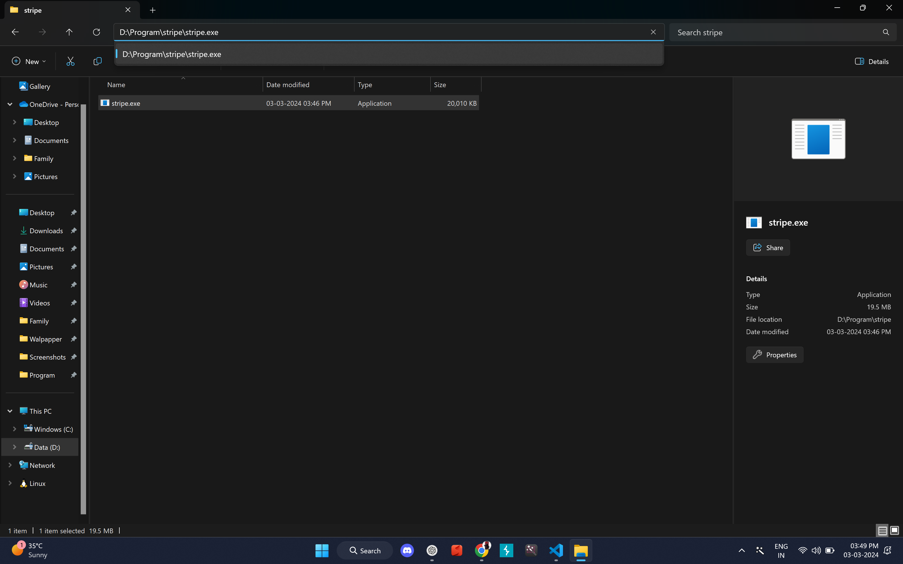

# Stripe Payment Application


## Getting Started

First, run the development server:

```bash
npm run dev
# or
yarn dev
# or
pnpm dev
# or
bun dev
```

Open [http://localhost:3000](http://localhost:3000) with your browser to see the result.

You can start editing the page by modifying `app/page.tsx`. The page auto-updates as you edit the file.

This project uses [`next/font`](https://nextjs.org/docs/basic-features/font-optimization) to automatically optimize and load Inter, a custom Google Font.


---

# Stripe CLI Setup Guide

## Adding Stripe CLI to Path in Windows



To use the Stripe CLI from any command prompt or PowerShell window, you need to add the path to `stripe.exe` to your system's Path environment variable. Follow these steps:

1. Open PowerShell as an administrator.
2. Execute the following command:


```powershell
$Path = [Environment]::GetEnvironmentVariable('Path', 'User') + ';D:\Program\stripe'
[Environment]::SetEnvironmentVariable('Path', $Path, 'User')
```

[Click to know more](https://docs.stripe.com/stripe-cli)

---

To set up Stripe to listen for webhooks:

1. Install the Stripe CLI.
2. Open a terminal.
3. Run `stripe listen --forward-to localhost:3000/api/webhooks/stripe`, replacing `localhost:3000/api/webhooks/stripe` with your endpoint.
4. Copy the provided webhook signing secret for use in your endpoint validation.

For detailed steps, refer to the [Stripe documentation](https://stripe.com/docs/webhooks).